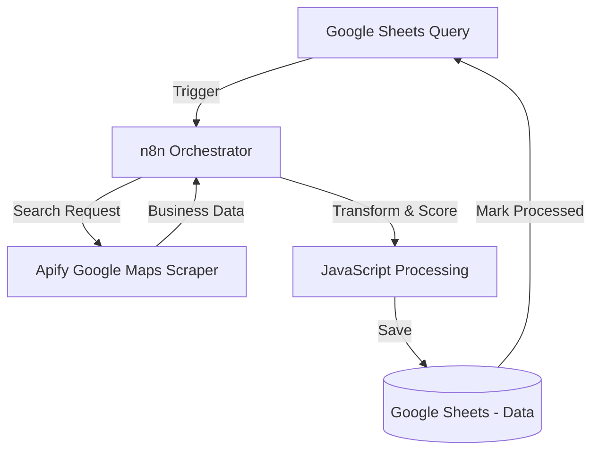
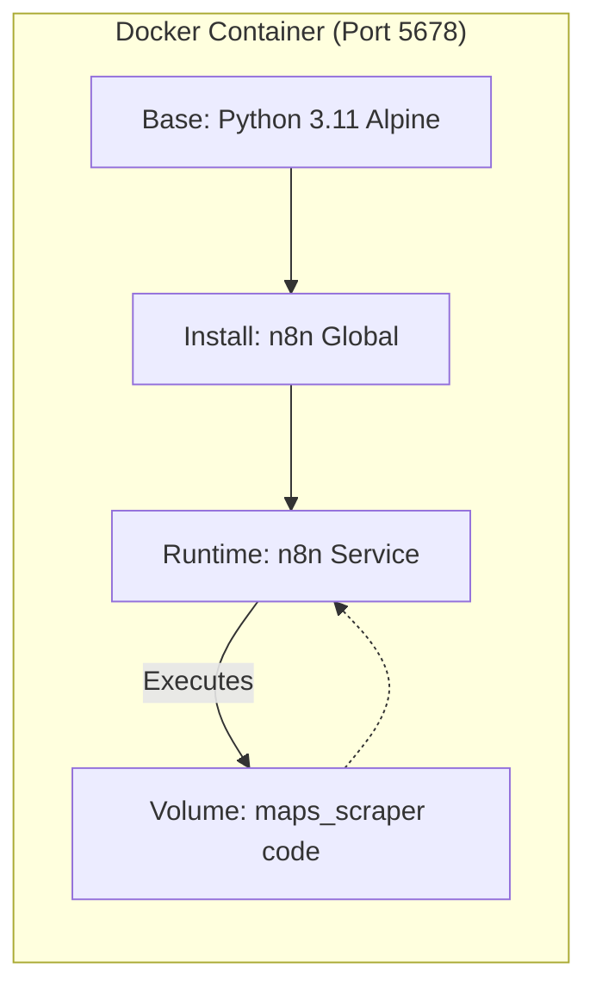

# Google Maps Business Scraper

[](https://opensource.org/licenses/MIT)
[](https://n8n.io)
[](https://apify.com)
[](https://sheets.google.com)
[](https://www.python.org)

**An automated business intelligence system that extracts and scores business data from Google Maps using intelligent ranking algorithms.**

---

## The Business Problem

- **Situation**: Manual research of business locations and market analysis is time-consuming and error-prone. Sales teams and market researchers spend hours gathering basic business intelligence that could be automated.
- **Task**: To architect an automated system capable of scraping Google Maps for business data, scoring businesses using intelligent algorithms, and organizing everything in a structured, actionable format.
- **Action**: I designed an automated workflow that integrates Apify for Google Maps scraping and Google Sheets for data storage. The system includes an intelligent Decision Score algorithm.
- **Result**: A production-ready framework that processes 15+ businesses per query automatically, reducing research time from hours to minutes.

---

## System Architecture

The system operates in three distinct layers:

1. **Ingestion Layer**: Queries are read from Google Sheets and sent to Apify for Google Maps scraping.
2. **Processing Layer (n8n)**: 
   - **Scraping Workflow**: Apify extracts business data from Google Maps.
   - **Transformation**: JavaScript nodes calculate Decision Scores based on rating, reviews, and availability.
3. **Storage Layer**: Results are organized in Google Sheets with structured business data.



---

## How it Works: Workflow Deep Dive

### The Main Scraper (gas_station_analyzer.json)
This is the core of the system. Every 30 minutes, n8n reads pending queries from Google Sheets.
- **The Process**: Apify's Google Places Crawler extracts up to 15 businesses per search query.
- **The Transformation**: JavaScript calculates a Decision Score based on rating, reviews, and availability.
- **The Output**: Structured data saved to Google Sheets with 10 fields per business.

---

## Decision Score Algorithm

The system calculates a weighted score (0-100) for each business:

```javascript
Decision_Score = (
  (Rating_Average / 5) * 40 +
  min(log(Total_Reviews + 1) * 10, 30) +
  (Open_24_Hours ? 10 : 0) +
  min(Amenities_Count * 5, 20)
) * 10 / 10
```

**Weights:**
- Rating Quality: 40%
- Review Volume: 30%
- 24/7 Availability: 10%
- Nearby Amenities: 20%

---

## Deployment Architecture

I utilize a **custom Docker container** that combines Python 3.11 and n8n. This approach ensures a consistent environment where all scripts run natively without external dependencies.



## Quick Start

### Prerequisites
- n8n instance (local or cloud)
- Apify API key ([free tier available](https://apify.com/pricing))
- Google Cloud OAuth2 credentials

### Installation

1. **Configure environment**
   ```bash
   cp .env.example .env
   # Edit .env with your API keys
   ```

2. **Install Python dependencies**
   ```bash
   pip install -r requirements.txt
   ```

3. **Run diagnostic**
   ```bash
   python3 scripts/diagnostic.py
   ```

4. **Import workflow to n8n**
   - Open n8n at http://localhost:5678
   - Import `workflows/gas_station_analyzer.json`
   - Configure credentials (Google Sheets, Apify)

5. **Activate workflow**
   - Toggle workflow to Active
   - It will run every 30 minutes automatically

For detailed deployment instructions, see [docs/DEPLOYMENT.md](docs/DEPLOYMENT.md)

---

## Output Data Schema

### Business Data Sheet
| Field | Description |
|-------|-------------|
| Station_ID | Unique Google Place ID |
| Station_Name | Business name |
| Address | Full street address |
| Latitude | Geographic latitude |
| Longitude | Geographic longitude |
| Rating_Average | Google Maps rating (1-5) |
| Total_Reviews | Number of reviews |
| Open_24_Hours | 24/7 availability status |
| Amenities_Count | Nearby amenities count |
| Decision_Score | Calculated score (0-100) |

---

## Technology Stack
- **Orchestration**: [n8n](https://n8n.io/) (Low-code workflow automation)
- **Scraping**: [Apify](https://apify.com/) (Google Maps data extraction)
- **Storage**: [Google Sheets](https://sheets.google.com/) (Data organization)
- **Scripting**: Python 3.8+ (Diagnostic tools)

---

## Project Structure

```
maps_scraper/
├── src/                  # Core Python logic
│   └── scorer.py         # Decision Score algorithm
├── tests/                # Unit tests
│   ├── __init__.py
│   └── test_scorer.py
├── scripts/              # Python diagnostic tools
│   ├── diagnostic.py     # System health checker
│   ├── fix_oauth.py      # OAuth2 reconnection tool
│   └── test_workflow.py  # Workflow testing guide
├── docs/                 # Documentation
│   └── images/           # Visual assets
├── workflows/            # n8n workflow exports
│   └── gas_station_analyzer.json
├── .env.example          # Environment template
├── Dockerfile            # Container definition
├── docker-compose.yml    # Container orchestration
├── requirements.txt      # Python dependencies
└── README.md             # This file
```

---

## Diagnostic Tools

### System Health Check
```bash
python3 scripts/diagnostic.py
```
Verifies:
- n8n server status
- API credentials
- Network connectivity
- Google Sheets access

### OAuth2 Fix
```bash
python3 scripts/fix_oauth.py
```
Opens n8n credentials page for Google Sheets re-authentication.

### Workflow Test Guide
```bash
python3 scripts/test_workflow.py
```
Provides step-by-step testing instructions.

---

## Contact & Collaboration
- **LinkedIn**: [daniel-garcia-belman-99a298aa](https://linkedin.com/in/daniel-garcía-belman-99a298aa)
- **Portfolio**: [danieljcvv-portfolio.vercel.app](https://danieljcvv-portfolio.vercel.app/)
- **Email**: [danielgb331@outlook.com](mailto:danielgb331@outlook.com)

---

*Developed by Daniel-jcVv | Powered by n8n, Apify & Google Sheets*

**Soli Deo Gloria.**
